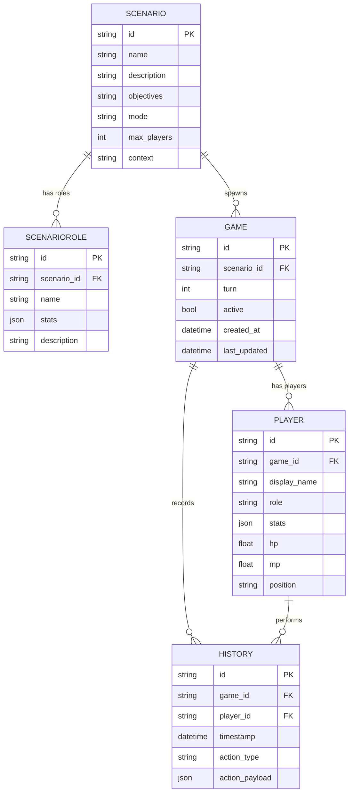

# Database

```mermaid
erDiagram
    SCENARIO {
        string id PK
        string name
        string description
        string objectives
        string mode
        int max_players
        string context
    }

    SCENARIOROLE {
        string id PK
        string scenario_id FK
        string name
        json stats
        string description
    }

    GAME {
        string id PK
        string scenario_id FK
        int turn
        bool active
        datetime created_at
        datetime last_updated
    }

    PLAYER {
        string id PK
        string game_id FK
        string display_name
        string role
        json stats
        float hp
        float mp
        string position
    }

    HISTORY {
        string id PK
        string game_id FK
        string player_id FK
        datetime timestamp
        string action_type
        json action_payload
    }

    %% Relations
    SCENARIO ||--o{ SCENARIOROLE : "has roles"
    SCENARIO ||--o{ GAME : "spawns"
    GAME ||--o{ PLAYER : "has players"
    GAME ||--o{ HISTORY : "records"
    PLAYER ||--o{ HISTORY : "performs"
```
